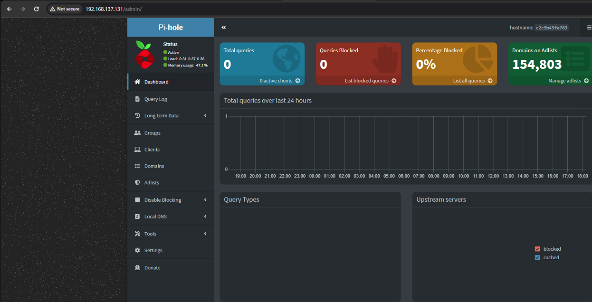

# docker install process
## By Mason Davenport

### Below are the steps I have taken to install docker as well as a pihole container. This Guide assumes you have a basic Ubuntu install with nothing else done yet.
#

## 1. Finding the guide

- 1.1. By navigating to the [Docker Install Guide](https://docs.docker.com/engine/install/ubuntu/#install-using-the-repository) you can select your preferred method of installing. 

- 1.2. I chose [Set up and install Docker Engine from Docker's apt repository](https://docs.docker.com/engine/install/ubuntu/#install-using-the-repository)

#

## 2. Utilizing the provided script

- 2.1. The linked guide provides the following script for adding docker to the apt repo list
```
# Add Docker's official GPG key:
sudo apt-get update
sudo apt-get install ca-certificates curl gnupg
sudo install -m 0755 -d /etc/apt/keyrings
curl -fsSL https://download.docker.com/linux/ubuntu/gpg | sudo gpg --dearmor -o /etc/apt/keyrings/docker.gpg
sudo chmod a+r /etc/apt/keyrings/docker.gpg

# Add the repository to Apt sources:
echo \
  "deb [arch="$(dpkg --print-architecture)" signed-by=/etc/apt/keyrings/docker.gpg] https://download.docker.com/linux/ubuntu \
  "$(. /etc/os-release && echo "$VERSION_CODENAME")" stable" | \
  sudo tee /etc/apt/sources.list.d/docker.list > /dev/null
sudo apt-get update
```

- 2.2. This can be copied and pasted into the terminal as is by first typing the backslash key "\\" and pressing enter.

- 2.3. Then paste in the previous script and press enter again.  
    
- 2.4. If prompted for a password. Enter your password that you have set.

- 2.5. If prompted for continuation type "y" and press enter.

#


## 3: Installing the Docker engine
 - 3.1. Your virtual machine should have docker added into the apt repo list. To now install docker run the following command: 

```
sudo apt-get install docker-ce docker-ce-cli containerd.io docker-buildx-plugin docker-compose-plugin
```
- 3.2. If prompted for continuation type "y" and press enter.

#
## 4: Test docker functionality
 - 4.1. To test the functionality of docker run the following command:
 ```
sudo docker run hello-world
 ```
- 4.2. This command simply looks for the image "hello-world" realizes that it does not exist locally. downloads the image and runs it.

#
## 5: Installing Pi-Hole
- 5.1. By navigating to the [Pi-Hole website](https://pi-hole.net/) you can select [install pi-hole](https://github.com/pi-hole/pi-hole/#method-3-using-docker-to-deploy-pi-hole).

- 5.2. We will be utilizing method 3 which is the docker method. 

- 5.3. Click on the [Pi-hole docker repo](https://github.com/pi-hole/docker-pi-hole#quick-start) link.
- 5.4. download the example docker compose file and name it "docker_compose.yml with the following command:
```
wget https://raw.githubusercontent.com/pi-hole/docker-pi-hole/master/examples/docker-compose.yml.example -O docker-compose.yml
```
- 5.5. edit the compose file using nano to customize the install.
```
nano docker-compose.yml
```
- 5.6. Specifically I am uncommenting the WEBPASSWORD field and setting a password I will also be changing the host port from 53 to 54 to work around a specific error where ubuntu was already using port 53
```
version: "3"

# https://github.com/pi-hole/docker-pi-hole/blob/master/README.md

services:
  pihole:
    container_name: pihole
    image: pihole/pihole:latest
    # For DHCP it is recommended to remove these ports and instead add: network_mode: "host"
    ports:
      - "54:53/tcp"
      - "54:53/udp"
      - "67:67/udp"
      - "80:80/tcp"
    environment:
      TZ: 'America/Chicago'
      WEBPASSWORD: 'passwordhere'
    # Volumes store your data between container upgrades
    volumes:
      - './etc-pihole:/etc/pihole'
      - './etc-dnsmasq.d:/etc/dnsmasq.d'
    #   https://github.com/pi-hole/docker-pi-hole#note-on-capabilities
    cap_add:
      - NET_ADMIN
    restart: unless-stopped # Recommended but not required (DHCP needs NET_ADMIN)  
```
- 5.7. after you are done editing. save and exit nano with "ctrl + s" and "ctrl + x" respectively

- 5.8. Now you can run the docker compose command to build and launch the pihole container.
```
sudo docker compose up -d
```
- 5.9. Pihole is now accessable from within the vm via
```
http://localhost/admin
```
- 5.10. If you would like to access pihole from your host, there are a couple of pre-requisites.
    - network type is set to NAT
    - locate the ip of the vm using "ip addr" we are looking for the inet address listed under  ens33. for me the address is 192.168.137.131
```
http://192.168.137.131/admin
```

#