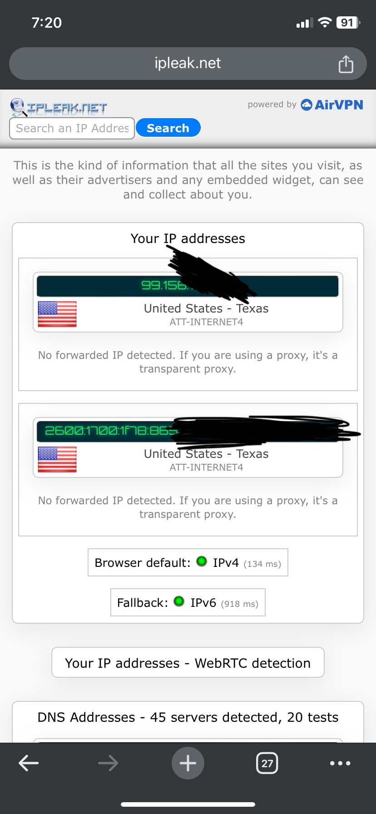
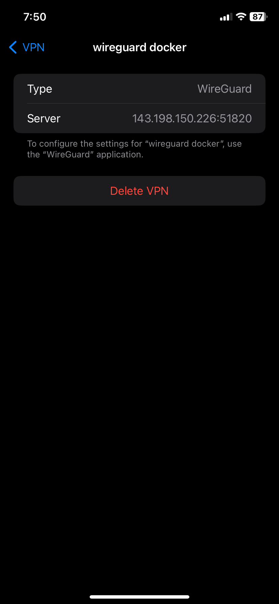
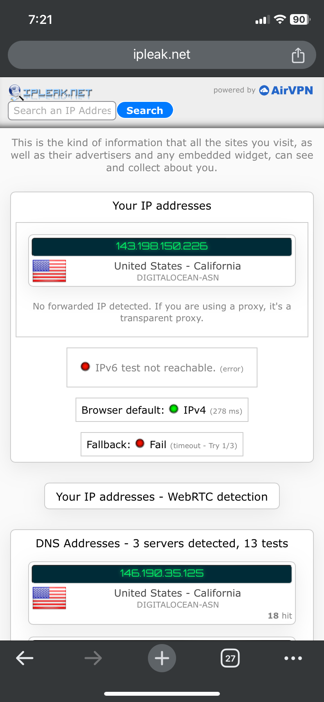
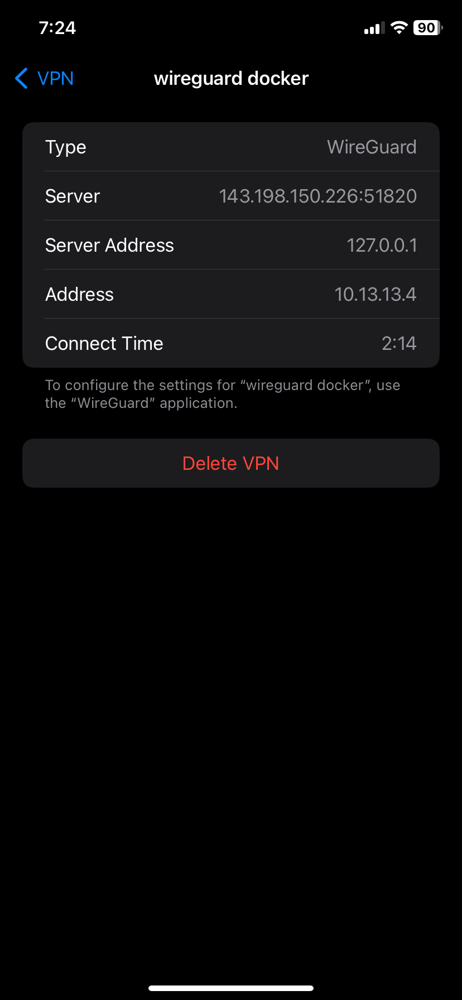
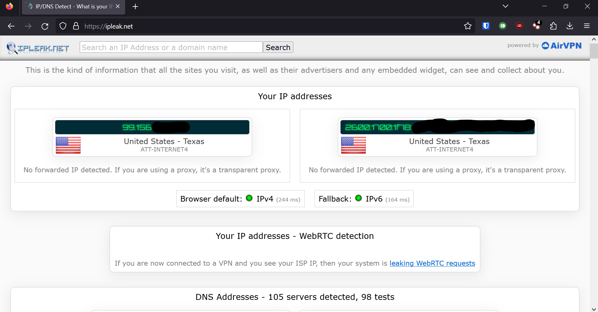
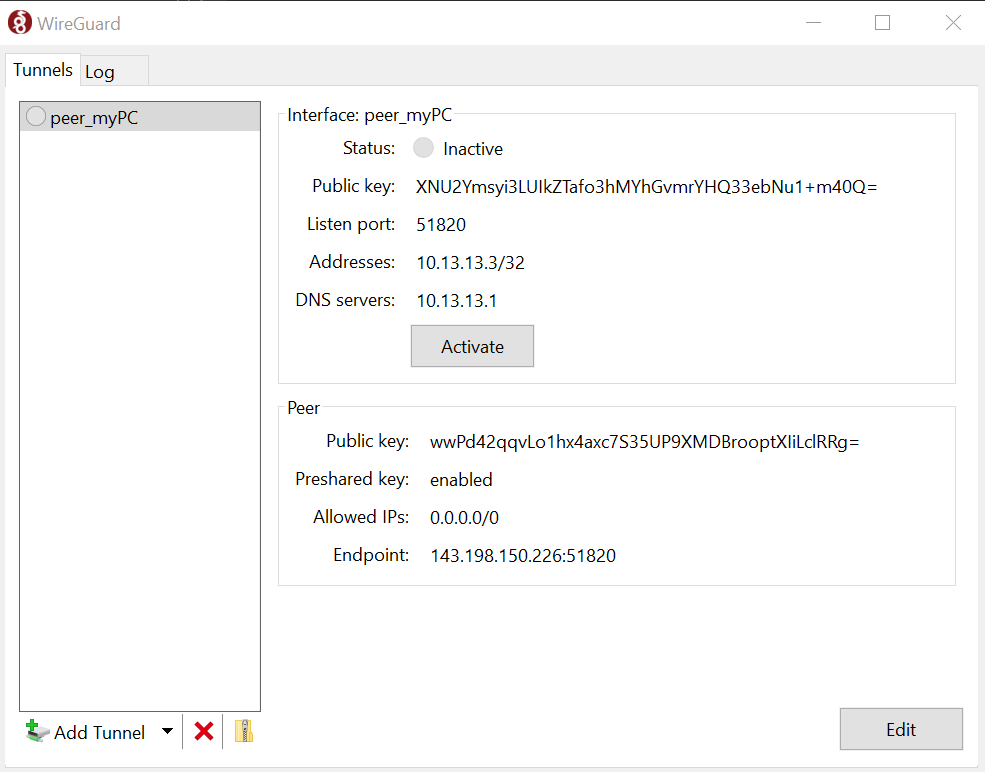
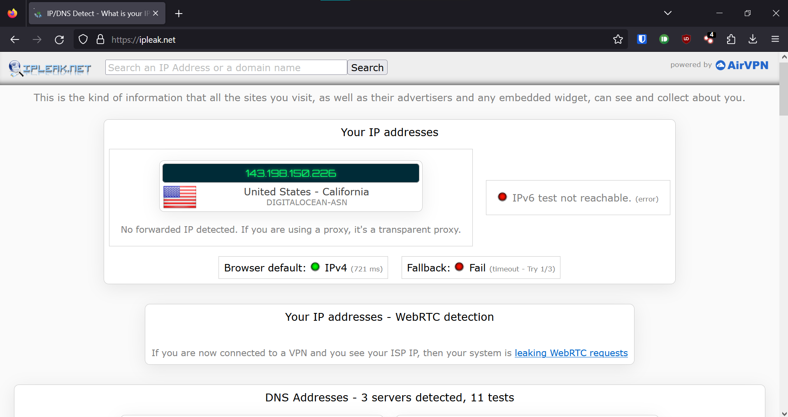
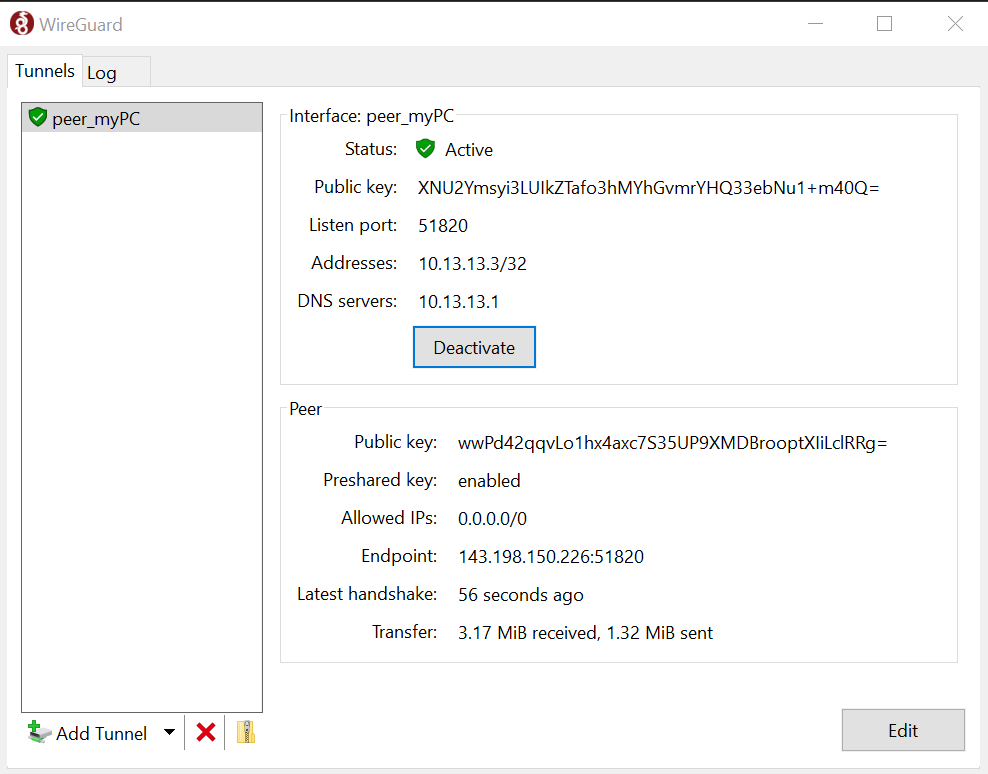

# Wireguard install process
## By Mason Davenport

### Below are the steps I have taken to install Docker as well as a Wireguard container through the digital oceans platform. As well as demonstrating use.
### This Guide assumes you have already created an digital ocean account and started up a basic Ubuntu Droplet. We will also be utilizing the built in web console.
#

## 1. Finding the guide

- 1.1. By navigating to the [Docker Install Guide](https://docs.docker.com/engine/install/ubuntu/#install-using-the-repository) you can select your preferred method of installing. 

- 1.2. I chose [Set up and install Docker Engine from Docker's apt repository](https://docs.docker.com/engine/install/ubuntu/#install-using-the-repository)

#

## 2. Utilizing the provided script

- 2.1. The linked guide provides the following script for adding docker to the apt repo list
```
# Add Docker's official GPG key:
sudo apt-get update
sudo apt-get install ca-certificates curl gnupg
sudo install -m 0755 -d /etc/apt/keyrings
curl -fsSL https://download.docker.com/linux/ubuntu/gpg | sudo gpg --dearmor -o /etc/apt/keyrings/docker.gpg
sudo chmod a+r /etc/apt/keyrings/docker.gpg

# Add the repository to Apt sources:
echo \
  "deb [arch="$(dpkg --print-architecture)" signed-by=/etc/apt/keyrings/docker.gpg] https://download.docker.com/linux/ubuntu \
  "$(. /etc/os-release && echo "$VERSION_CODENAME")" stable" | \
  sudo tee /etc/apt/sources.list.d/docker.list > /dev/null
sudo apt-get update
```

- 2.2. This can be copied and pasted into the terminal as is by first typing the backslash key "\\" and pressing enter.

- 2.3. Then paste in the previous script and press enter again.  
    
- 2.4. If prompted for a password. Enter your password that you have set.

- 2.5. If prompted for continuation type "y" and press enter.

#


## 3: Installing the Docker engine
 - 3.1. Your virtual machine should have docker added into the apt repo list. To now install docker run the following command: 

```
sudo apt-get install docker-ce docker-ce-cli containerd.io docker-buildx-plugin docker-compose-plugin
```
- 3.2. If prompted for continuation type "y" and press enter.

#
## 4: Test docker functionality
 - 4.1. To test the functionality of docker run the following command:
 ```
sudo docker run hello-world
 ```
- 4.2. This command simply looks for the image "hello-world" realizes that it does not exist locally. downloads the image and runs it.

#
## 5: Installing Wireguard
- 5.1. By navigating to the following github repo from linuxserver [docker-wireguard](https://github.com/linuxserver/docker-wireguard#docker-cli-click-here-for-more-info) you will find the command that we will be inputting into the web console.

- 5.2. The linked guide provides the following script for pasting into the docker compose file that you can first create by typing:
```
nano docker-compose.yml
```
- 5.3. paste the following into the file:

`Keep in mind that you may need to modify the "SERVERURL" variable. to match your droplet IP address`
```
---
version: "2.1"
services:
  wireguard:
    image: lscr.io/linuxserver/wireguard:latest
    container_name: wireguard
    cap_add:
      - NET_ADMIN
      - SYS_MODULE #optional
    environment:
      - PUID=1000
      - PGID=1000
      - TZ=Etc/UTC
      - SERVERURL=143.198.150.226 #optional
      - SERVERPORT=51820 #optional
      - PEERS=myPC,myPhone #optional
      - PEERDNS=auto #optional
      - INTERNAL_SUBNET=10.13.13.0 #optional
      - ALLOWEDIPS=0.0.0.0/0 #optional
      - PERSISTENTKEEPALIVE_PEERS= #optional
      - LOG_CONFS=true #optional
    volumes:
      - /path/to/appdata/config:/config
      - /lib/modules:/lib/modules #optional
    ports:
      - 51820:51820/udp
    sysctls:
      - net.ipv4.conf.all.src_valid_mark=1
    restart: unless-stopped
```

- 5.4. after you are done editing. save and exit nano with "ctrl + s" and "ctrl + x" respectively

- 5.5. Now you can run the docker compose command to build and launch the Wireguard container.
```
sudo docker compose up -d
```
- 5.6. Wireguard is now running and you can access the setup qr codes by running the command:
```
docker compose logs -f wireguard
```
- 5.7. you will need to install the wireguard app on both your phone and laptop.
    - [iPhone](https://itunes.apple.com/us/app/wireguard/id1441195209?ls=1&mt=8) 
    - [Android](https://play.google.com/store/apps/details?id=com.wireguard.android)
    - [Windows PC](https://download.wireguard.com/windows-client/wireguard-installer.exe)
    - [Mac OS](https://itunes.apple.com/us/app/wireguard/id1451685025?ls=1&mt=12)
- 5.8. after installing the app on your phone you will scan the qr code that was generated in the previous command
    - iPhone Disconnected
    - iPhone Tunnel Disconnected
    - iPhone Connected
    - iPhone Tunnel Connected
- 5.9. After installing the app on your laptop you will need to locate the config file on the docker container and import that into your wireguard app. I did this with the following command:
```
docker exec wireguard cat /config/peer_myPC/peer_myPC.conf
```
- 
    - Laptop Disconnected
    - Laptop Tunnel Disconnected
    - Laptop Connected
    - Laptop Tunnel Connected
#